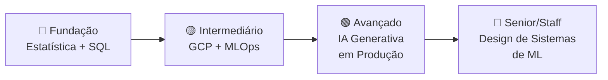

# 🎯 Roadmap de Aprendizado — Data Scientist

> Este arquivo é um plano pessoal de estudos. **Não está conectado ao sistema web do portfólio.**
> Use como referência para orientar seus próximos passos.

---

## 📊 Fase 1 — Fundação Estatística (Curto Prazo)

| Tópico | Status | Prioridade |
|---|---|---|
| Estatística Descritiva — média, mediana, moda, dispersão, quartis | ✅ Conhecimento médio | — |
| Distribuições de probabilidade — normal, binomial, Poisson | 🔶 Aprofundar | 🔴 Alta |
| Teorema Central do Limite | 🔶 Aprofundar | 🔴 Alta |
| Testes de Hipótese — t-test, chi-square, ANOVA | 🔶 Em estudo | 🔴 Alta |
| Inferência Estatística — intervalos de confiança, p-valor | 🔶 Em estudo | 🔴 Alta |
| Testes A/B — design, tamanho de amostra, significância prática | ⬜ Aprender | 🔴 Alta |
| Causalidade — diferença de correlação, DAGs, propensity score | ⬜ Aprender | 🟡 Média |

**Recursos recomendados:**
- Livro: *Practical Statistics for Data Scientists* (Bruce & Bruce)
- Curso: *Statistical Inference* (Coursera — Johns Hopkins)
- Ferramenta: `scipy.stats`, `statsmodels`

---

## ☁️ Fase 2 — GCP para Machine Learning (Curto-Médio Prazo)

| Tópico | Status | Prioridade |
|---|---|---|
| BigQuery — queries analíticas, ML com BigQuery ML | ✅ Conhecimento prático | — |
| Cloud Storage — data lake, formatos (Parquet, Avro) | ✅ Conhecimento prático | — |
| Vertex AI Experiments — tracking de experimentos | ⬜ Aprender | 🔴 Alta |
| Vertex AI Pipelines — orquestração nativa (Kubeflow) | ⬜ Aprender | 🔴 Alta |
| Vertex AI Model Registry — versionamento de modelos | ⬜ Aprender | 🔴 Alta |
| Vertex AI Endpoints — deploy e monitoramento | ⬜ Aprender | 🔴 Alta |
| Vertex AI Feature Store — feature engineering em escala | ⬜ Aprender | 🟡 Média |
| Vertex AI Workbench — notebooks gerenciados | ⬜ Aprender | 🟢 Baixa |

**Recursos recomendados:**
- Google Cloud Skills Boost: *ML on Google Cloud* (learning path)
- Laboratórios práticos no Qwiklabs
- Documentação oficial: [Vertex AI Docs](https://cloud.google.com/vertex-ai/docs)

---

## 🤖 Fase 3 — IA Generativa & Agentes (Médio Prazo)

| Tópico | Status | Prioridade |
|---|---|---|
| RAG básico — chunking, embeddings, retrieval | ✅ Conhecimento prático | — |
| RAG avançado — re-ranking, hybrid search, query expansion | 🔶 Aprofundar | 🔴 Alta |
| Agentes simples — tool calling, ReAct pattern | ✅ Conhecimento prático | — |
| Multi-agentes — orquestração, memória compartilhada, debate | 🔶 Em estudo | 🔴 Alta |
| Avaliação de LLMs — RAGAS, métricas de fidelidade e relevância | ⬜ Aprender | 🔴 Alta |
| Grounding — Vertex AI Grounding, Google Search grounding | ⬜ Aprender | 🟡 Média |
| Fine-tuning — LoRA, QLoRA, PEFT | ⬜ Aprender | 🟡 Média |

**Recursos recomendados:**
- Framework: LangChain, LlamaIndex, CrewAI
- Avaliação: RAGAS, DeepEval
- Curso: *Generative AI with Vertex AI* (Google Cloud)

---

## ⚙️ Fase 4 — MLOps & Engenharia de ML (Médio-Longo Prazo)

| Tópico | Status | Prioridade |
|---|---|---|
| CI/CD para ML — testes de dados, modelo e pipeline | 🔶 Em estudo | 🔴 Alta |
| Monitoramento — data drift, concept drift, performance decay | ⬜ Aprender | 🔴 Alta |
| Feature Stores — Feast ou Vertex AI Feature Store | ⬜ Aprender | 🟡 Média |
| MLflow — experiment tracking, model registry open-source | ⬜ Aprender | 🟡 Média |
| Apache Airflow — orquestração de pipelines complexos | 🔶 Em estudo | 🟡 Média |
| Containers avançados — Docker Compose multi-serviço, Kubernetes básico | 🔶 Básico | 🟢 Baixa |

**Recursos recomendados:**
- Livro: *Designing Machine Learning Systems* (Chip Huyen)
- Curso: *MLOps Zoomcamp* (DataTalksClub — gratuito)
- Ferramenta: MLflow, Kubeflow, Airflow

---

## 📈 Resumo Visual de Progressão

---

## 🗓️ Sugestão de Cronograma

| Mês | Foco Principal | Entregável |
|---|---|---|
| **1-2** | Estatística inferencial + Testes A/B | Notebook com análise estatística real |
| **3-4** | Vertex AI Pipelines + Model Registry | Pipeline end-to-end no GCP |
| **5-6** | RAG avançado + Avaliação de LLMs | Sistema RAG com métricas RAGAS |
| **7-8** | Multi-agentes + MLOps | Projeto com agentes em produção |
| **9-12** | Consolidação + Portfolio projects | Case studies publicados |

---

> **Nota:** Atualize este arquivo conforme for evoluindo. Marque `✅` quando dominar um tópico.
